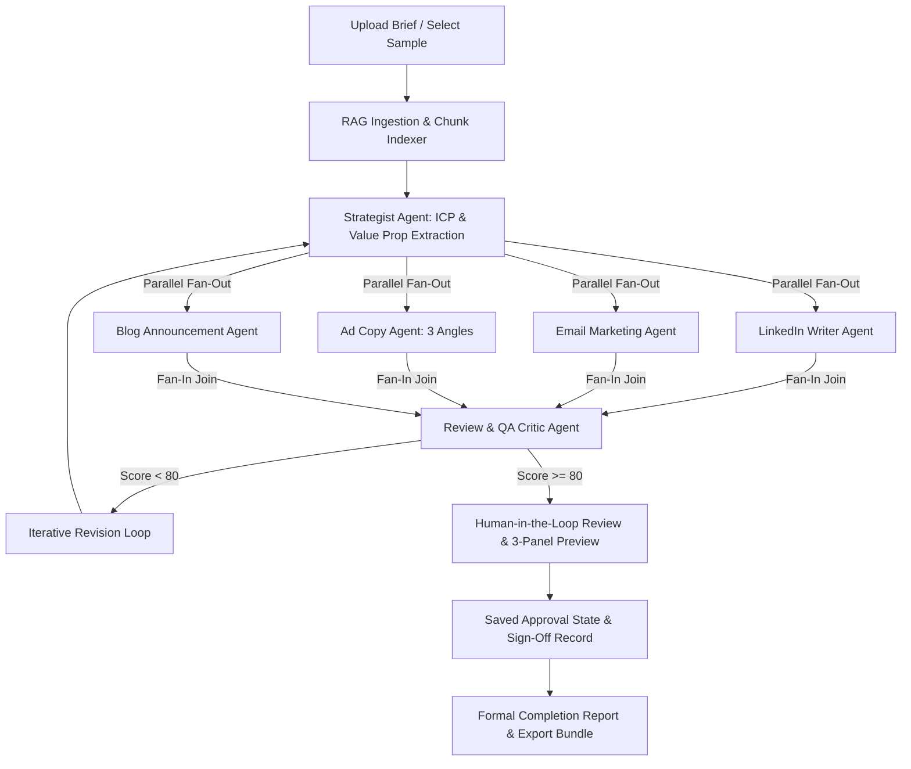

# 🚀 Multi-Agent GTM Content Engine (Project 3D: Ideation to Copy)

> **Mastering Agentic AI Certification — Week 3 Project**  
> An autonomous, stateful multi-agent system powered by **LangGraph (Parallel Fan-Out/Fan-In Graph)**, **LangChain**, **Ollama (`llama3.2:latest`)**, **Google Gemini**, and **Streamlit**.

---

## 📺 Demo Video & Live Application
- **Demo Recording (YouTube)**: [Watch 5-Minute YouTube Walkthrough](https://youtu.be/YOUR_YOUTUBE_ID_HERE) *(Replace with your YouTube URL)*
- **Live Cloud Application**: [https://gtmcontent.streamlit.app](https://gtmcontent.streamlit.app)
- **GitHub Repository**: [https://github.com/dyidesi/Multi-Agent-GTM-Content-Engine](https://github.com/dyidesi/Multi-Agent-GTM-Content-Engine)

---

## 📌 Framework One-Liner (Rubric Page 6)
> *"My agent helps **Product & Marketing Managers** generate a verified, multi-channel go-to-market content suite (LinkedIn, Email, Ads, Blog) in a **Streamlit 3-panel workspace**, replacing the **4+ hours of manual drafting and cross-checking specs**. It extracts context via **RAG**, executes **parallel writer agents via LangGraph fan-out**, and audits tone and factual alignment with a **Review QA Critic Agent** before capturing human sign-off and generating an official **Completion Report**."*

---

## 🏗️ Parallel Fan-Out & Fan-In Architecture

The state graph uses **true parallel fan-out** where the extracted strategy triggers all 4 specialized copywriters concurrently, and then performs a **fan-in join** into the QA Critic node:



### Specialized Agents:
1. **Strategist Agent**: Extracts core ICP, value pillars, key features, pricing, and launch dates from raw documents.
2. **LinkedIn Agent** *(Parallel Wave)*: Writes high-signal, hook-driven social launch posts with appropriate formatting and hashtags.
3. **Email Marketing Agent** *(Parallel Wave)*: Drafts conversion-oriented announcement emails with multiple subject lines and preview text.
4. **Ad Copy Agent** *(Parallel Wave)*: Creates 3 distinct paid social variations (Pain-point, Benefit/Speed, Urgency/Launch Offer).
5. **Blog Editorial Agent** *(Parallel Wave)*: Produces structured announcement blog posts with technical depth and architecture callouts.
6. **QA Critic Agent** *(Fan-In Join)*: Audits factual grounding against the source brief to eliminate hallucinations, verifies brand tone, and assigns an audit score (0-100).

---

## ✨ Key System Features

- **⚡ True Parallel Fan-Out & Fan-In**:
  - Implemented in `gtm_core/graph.py` with `Annotated[List[str], operator.add]` state reducers to merge concurrent agent updates without conflict.
- **📋 Completion Report & Saved Approval State**:
  - Formal sign-off tab allowing human reviewers to record reviewer name, decision (`APPROVED ✅`), timestamp, and audit remarks.
  - Generates verifiable `Completion_Report.md` and signed `gtm_assets.json` bundles.
- **🦙 First-Class Local Ollama Support (Default)**:
  - Powered by `langchain-ollama` (`llama3.2:latest`) for private, local execution.
  - Automatic discovery of local Ollama models on `localhost:11434`.
- **🟢 Google Gemini Dynamic Discovery**:
  - Automatic `ListModels` discovery for Gemini API keys with `gemini-flash-lite-latest` default priority.
- **🌙 Obsidian Dark Theme & 3-Panel Side-by-Side Workspace**:
  - Left Panel: Configuration & Models.
  - Middle Panel: Human-in-the-Loop Editor.
  - Right Panel: Real-time rendered Markdown Preview.

---

## ⚡ Quickstart & Running Locally

### 1. Install Dependencies
```bash
uv pip install -r requirements.txt
# Or: py -3.12 -m pip install -r requirements.txt
```

### 2. Run Automated Verification Test
```bash
py -3.12 test_workflow.py
```

### 3. Launch the Streamlit Web Application
```bash
py -3.12 -m streamlit run app.py
```

---

## 📋 Framework Answers (Rubric Page 7)

| Field | Description |
| :--- | :--- |
| **Agent Goal** | Converts raw product briefs into a complete, verified GTM content suite across 4 channels. |
| **Where do people use it?** | Interactive Streamlit 3-panel web portal with live Markdown preview. |
| **Steps in order** | 1. Ingest/RAG $\to$ 2. Strategic extraction $\to$ 3. **Parallel writer fan-out** $\to$ 4. **QA Critic fan-in audit** $\to$ 5. **Human sign-off & saved approval state** $\to$ 6. **Formal completion report**. |
| **Actions & Tools** | PDF/MD text extraction, keyword/semantic chunk retrieval, structured LLM generation, JSON parsing, automated export. |
| **State & Memory** | TypedDict LangGraph state with `Annotated` reducer holding document context, intermediate drafts, review scores, approval status, and timestamps. |
| **Hard Limits** | Never invent hallucinated pricing, never publish without passing QA score, never alter human edits. |
| **Human-in-the-Loop** | 3-Panel editor and live rendered Markdown preview for every channel with explicit sign-off state saving. |
| **Failure Recovery** | Automatic revision loop on low QA score; graceful parsing fallbacks on malformed LLM outputs. |
| **Success Metric** | Produces ready-to-publish 4-channel GTM kit with QA score $\ge 80\%$ and saved approval state in under 30 seconds. |
