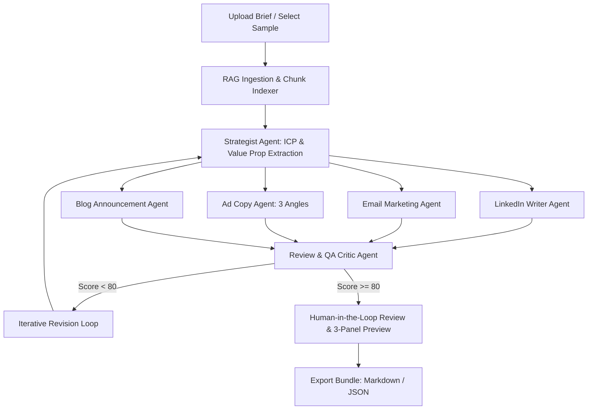

# 🚀 GTM Agent: Ideation to Copy (Project 3D)

> **Mastering Agentic AI Certification — Week 3 Project**  
> An autonomous, stateful multi-agent system powered by **LangGraph**, **LangChain**, **Ollama (`llama3.2:latest`)**, and **Streamlit** that transforms unstructured product briefs into a fully audited Go-To-Market content suite.

---

## 📌 Framework One-Liner (Rubric Page 6)
> *"My agent helps **Product & Marketing Managers** generate a multi-channel go-to-market content suite (LinkedIn, Email, Ads, Blog) in a **Streamlit web application**, replacing the **4+ hours of manual drafting and cross-checking specs**. It extracts context via **RAG**, drafts content using **specialized writer agents**, and critiques tone and factual alignment with a **Review QA Agent** before handing off to the human for final approval and export."*

---

## 🏗️ Architecture & State Machine



### Specialized Agents:
1. **Strategist Agent**: Extracts core ICP, value pillars, key features, pricing, and launch dates from raw documents.
2. **LinkedIn Agent**: Writes high-signal, hook-driven social launch posts with appropriate formatting and hashtags.
3. **Email Marketing Agent**: Drafts conversion-oriented announcement emails with multiple subject lines and preview text.
4. **Ad Copy Agent**: Creates 3 distinct paid social variations (Pain-point, Benefit/Speed, Urgency/Launch Offer).
5. **Blog Editorial Agent**: Produces structured announcement blog posts with technical depth and architecture callouts.
6. **QA Critic Agent**: Audits factual grounding against the source brief to eliminate hallucinations and evaluates tone consistency.

---

## ✨ Latest Features & Enhancements

- **🦙 First-Class Local Ollama Support (Default)**:
  - Powered by `langchain-ollama`.
  - Default Provider: **Ollama (Local)**.
  - Default Model: **`llama3.2:latest`**.
  - Automatically discovers locally installed models from `http://localhost:11434/api/tags`.
- **🌙 Modern Dark Theme**:
  - Deep Obsidian/Slate palette (`#0B0F19` background, `#161E2E` card surfaces, `#6366F1` indigo accents).
  - Custom glassmorphic cards, gradient headers, and styled code containers.
- **🖥️ 3-Panel Side-by-Side Live Markdown Preview**:
  - **Left Panel (Sidebar)**: Model selection, Ollama status, and campaign tone settings.
  - **Middle Panel (Editor)**: Full-height Human-in-the-Loop text area for live copy editing.
  - **Right Panel (Preview)**: Real-time Markdown rendering for LinkedIn posts, emails, ad copy, and blog articles.
  - **Toggle**: Quick toggle switch to alternate between side-by-side split and full-width editor.
- **📦 1-Click Export**:
  - Export complete finalized campaign kits as formatted Markdown (`.md`) or structured JSON data.

---

## ⚡ Quickstart & Running Locally

### 1. Install Dependencies
Using `uv` (recommended) or standard `pip`:

```bash
# Using uv:
uv pip install -r requirements.txt

# Or using standard pip:
py -3.12 -m pip install -r requirements.txt
```

### 2. Run the Test Verification Script
```bash
py -3.12 test_workflow.py
```

### 3. Launch the Streamlit Web Application
```bash
py -3.12 -m streamlit run app.py
```

---

## 🎛️ Supported LLM Backends
- **Ollama (Local)** (Default: `llama3.2:latest`, zero external API cost)
- **Google Gemini** (`gemini-1.5-pro`, `gemini-1.5-flash`, `gemini-2.0-flash-exp`)
- **OpenAI** (`gpt-4o-mini`, `gpt-4o`, `gpt-3.5-turbo`)
- **Anthropic** (`claude-3-5-sonnet-20240620`, `claude-3-haiku-20240307`)
- **Demo / Mock Mode** (Instant offline execution)

---

## 📋 Framework Answers (Rubric Page 7)

| Field | Description |
| :--- | :--- |
| **Agent Goal** | Converts raw product briefs into a complete, verified GTM content suite across 4 channels. |
| **Where do people use it?** | Interactive Streamlit web portal with 3-panel side-by-side editing and live preview. |
| **Steps in order** | 1. Ingest/RAG $\to$ 2. Strategic extraction $\to$ 3. Multi-agent drafting $\to$ 4. QA Critic audit $\to$ 5. Human approval/export. |
| **Actions & Tools** | PDF/MD text extraction, keyword/semantic chunk retrieval, structured LLM generation, JSON parsing, automated export. |
| **State & Memory** | TypedDict LangGraph state holding document context, intermediate drafts, review scores, and revision counts. |
| **Hard Limits** | Never invent hallucinated pricing, never publish without passing QA score, never alter user edits. |
| **Human-in-the-Loop** | 3-Panel editor and live rendered Markdown preview for every channel before final export approval. |
| **Failure Recovery** | Automatic revision loop on low QA score; graceful parsing fallbacks on malformed LLM outputs. |
| **Success Metric** | Produces ready-to-publish 4-channel GTM kit with QA score $\ge 80\%$ in under 30 seconds. |
